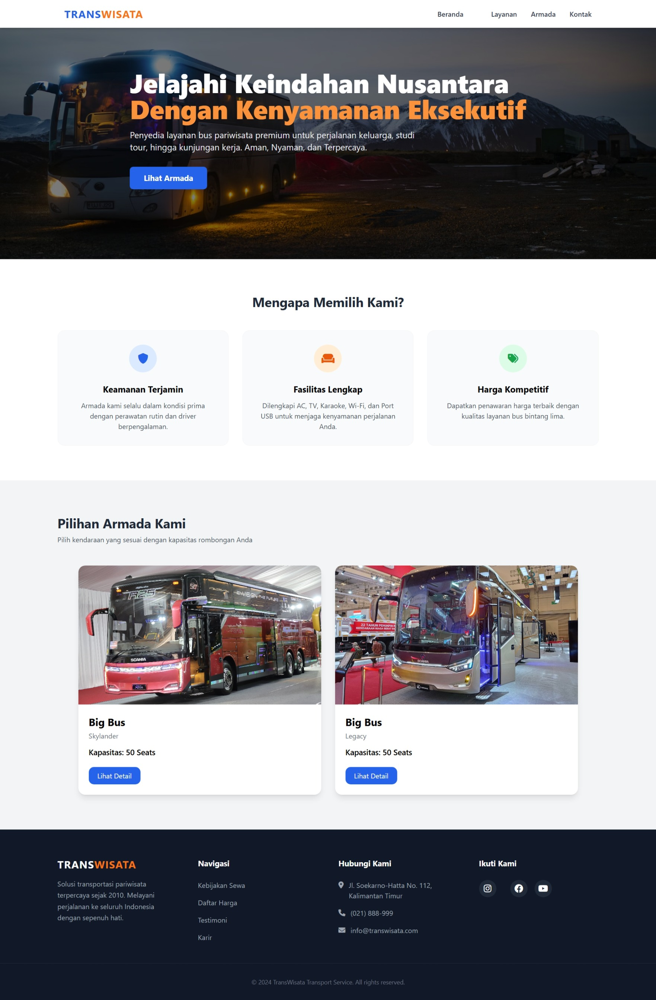
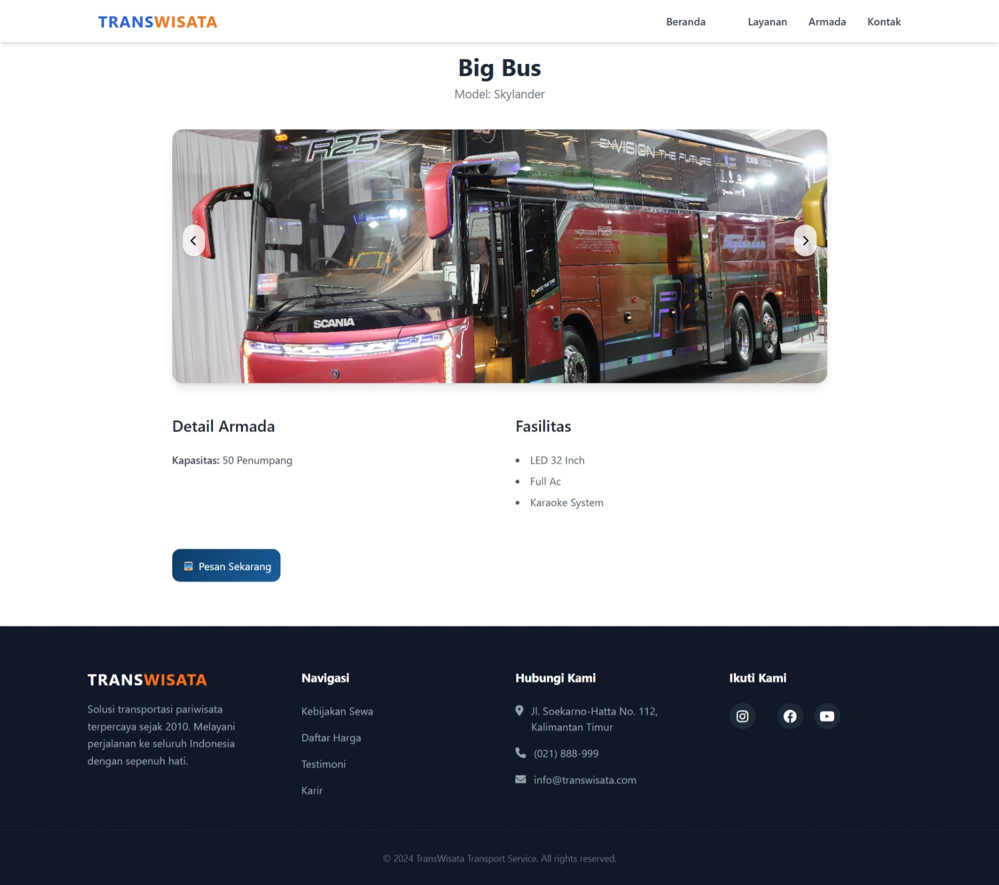
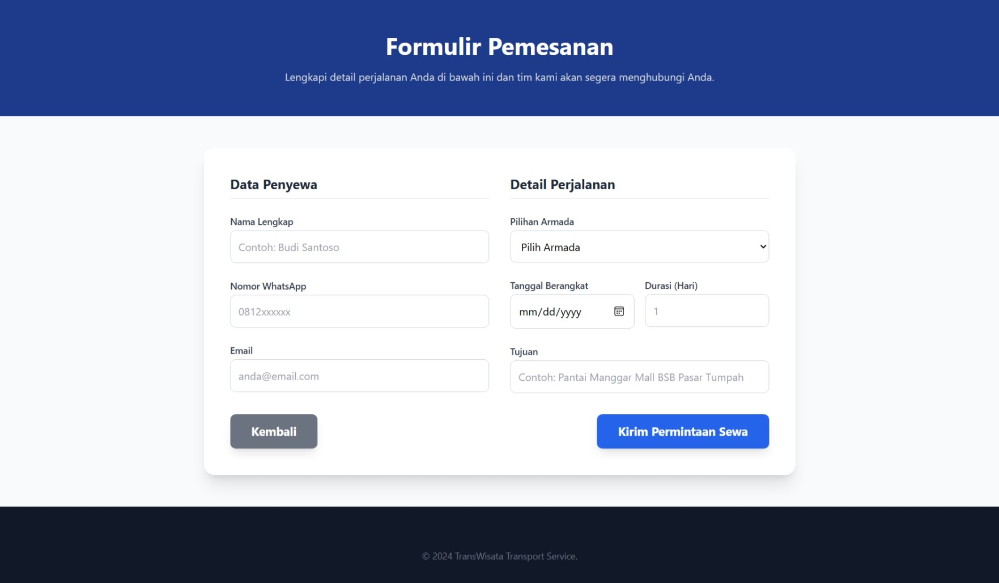
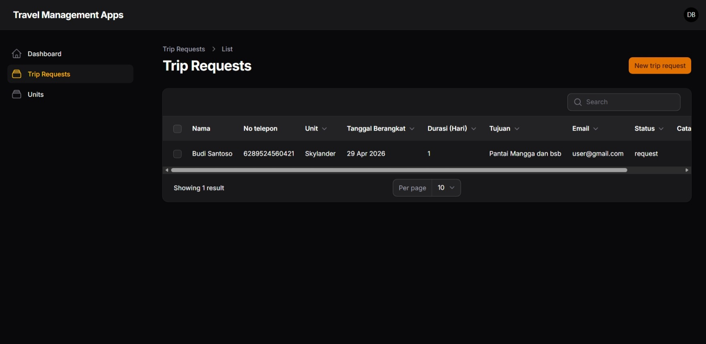
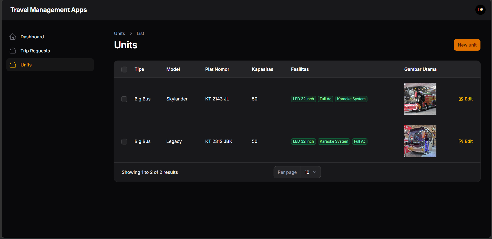

  

  
  
  
  

---

## 🚐 About Travel Booking System

**Travel Booking System** adalah aplikasi berbasis web yang dikembangkan untuk mempermudah proses pemesanan kendaraan pariwisata secara digital. Sistem ini mengintegrasikan sisi **frontend (pelanggan)** dan **backend (admin dashboard)** untuk menciptakan proses bisnis yang efisien, terstruktur, dan mudah digunakan.

Aplikasi ini dirancang untuk membantu perusahaan transportasi dalam mengelola armada dan permintaan perjalanan secara modern dan terpusat.

---

## ✨ Key Features

### 🌐 Landing Page

  

- Hero section dengan Call To Action
- Informasi keunggulan layanan
- Preview armada
- Navigasi responsif

---

### 🚌 Detail Armada

  

- Gambar armada (slider/carousel)
- Kapasitas penumpang
- Fasilitas lengkap
- Tombol pemesanan langsung

---

### 📝 Formulir Pemesanan

  

- Input data penyewa
- Pilihan armada
- Tanggal & durasi perjalanan
- Tujuan perjalanan
- Validasi form

---

### 📊 Trip Request Management (Admin)

  

- Monitoring permintaan perjalanan
- Informasi lengkap pelanggan
- Status pemesanan
- Fitur pencarian & filter

---

### 🚍 Unit Management (Admin)

  

- CRUD data armada
- Kapasitas dan fasilitas
- Upload gambar kendaraan

---

## 🧩 Technology Stack

- **Backend**: Laravel  
- **Frontend**: Blade / Tailwind CSS  
- **Admin Panel**: Filament  
- **Database**: MySQL  

---

## 🔄 System Workflow

1. User mengakses website
2. Memilih armada yang tersedia
3. Mengisi formulir pemesanan
4. Data masuk ke dashboard admin
5. Admin memproses permintaan

---

## 🎯 Purpose

- Digitalisasi sistem pemesanan travel
- Meningkatkan efisiensi operasional
- Mengurangi kesalahan manual
- Meningkatkan pengalaman pengguna
